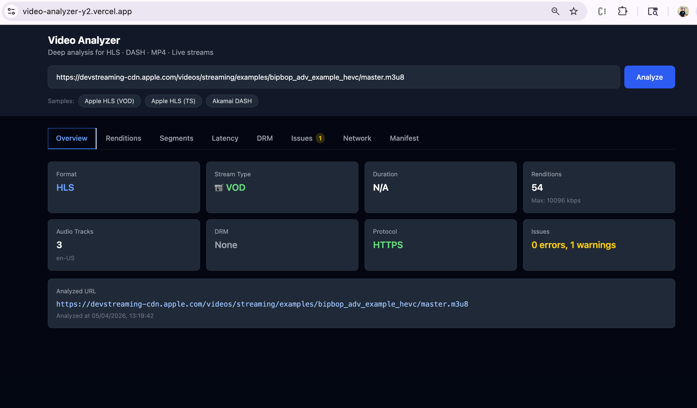
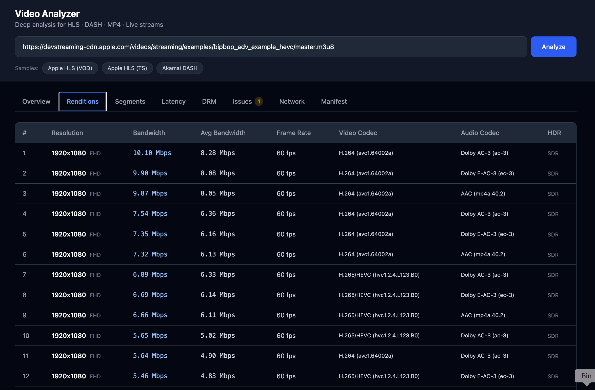
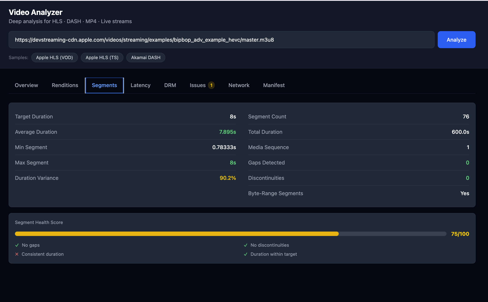
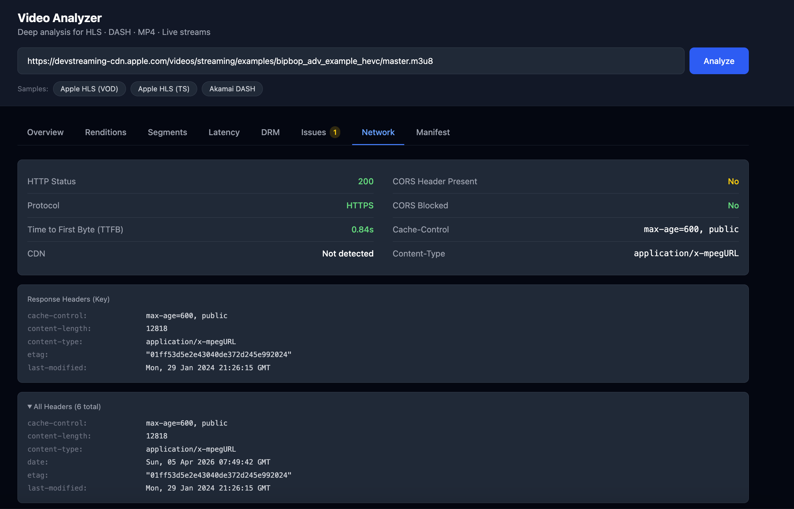

# Video Analyzer

A browser-based tool to inspect and debug video streams - paste any HLS, DASH, or MP4 URL and get a full breakdown of renditions, segments, DRM, latency, network health, and detected issues.

---

### Key Features

- **Multi-Format Support** - Analyzes HLS (`.m3u8`), DASH (`.mpd`), and MP4 streams
- **Adaptive Bitrate Analysis** - Extracts all available quality renditions with bitrate, resolution, and codec info
- **DRM Detection** - Identifies Widevine, PlayReady, FairPlay, and ClearKey encryption systems
- **Segment Health** - Inspects segment duration, gaps, and discontinuities with visual charts
- **Latency Estimation** - Calculates live stream latency and detects Low-Latency HLS (LL-HLS) support
- **Network Analysis** - Measures TTFB, detects CDN provider, and validates CORS headers
- **Automated Issue Detection** - Flags 20+ potential problems across security, performance, and compatibility
- **CORS Proxy Fallback** - Fetches cross-origin manifests automatically when direct access is blocked
- **8-Tab Interface** - Dedicated views for Overview, Renditions, Segments, Latency, DRM, Issues, Network, and raw Manifest

---

### Screenshots

 
 

 
 

 
 

 
